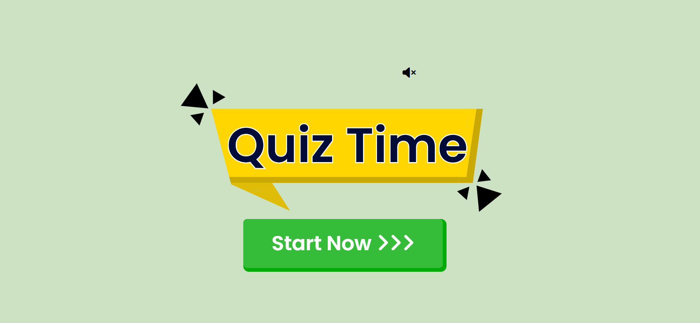
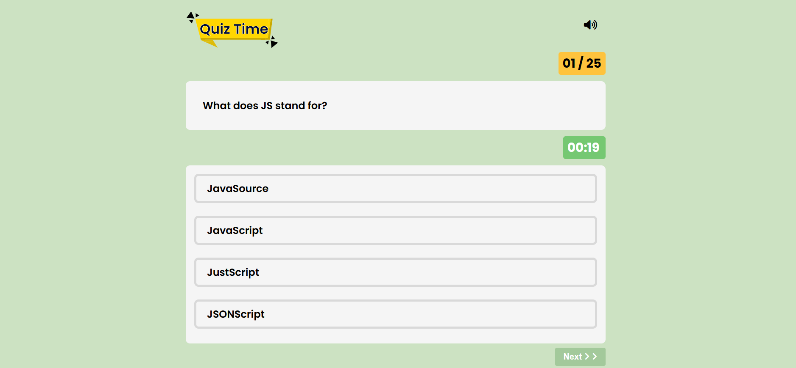
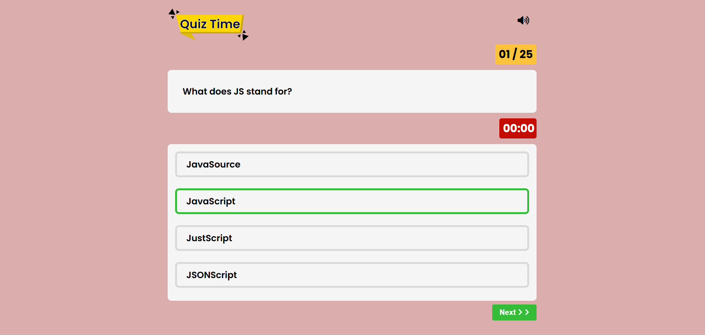
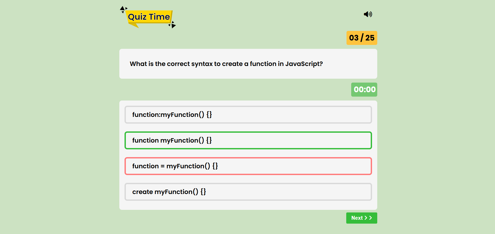
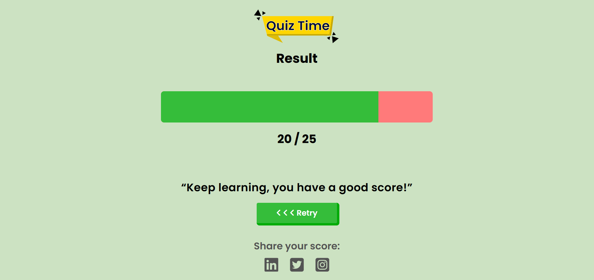

# Quiz Game

A fun and interactive quiz game built with HTML, CSS, and JavaScript. The project simulates a quiz experience where users can answer questions, track their scores, and even resume the quiz from where they left off if they close and revisit the site.

---

## Features

- **Dynamic Question Loading:** Fetches questions from a JSON file.
- **Interactive UI:** Engaging design and smooth user experience.
- **Progress Persistence:** Saves the current question, timer, and score using localStorage, allowing users to resume from where they left off.
- **Timer and Sound Effects:** Adds excitement with countdown timers and sound effects.
- **Results Page:** Displays the final score and performance.

---

## File Structure

```
quiz-game-main/
├── index.html                 # Entry point of the application
├── assets/
│   ├── images/
│   │   ├── favicon.ico        # Favicon for the site
│   │   └── quiz-logo.svg      # Logo used in the application
├── css/
│   └── style.css              # Styling for the application
├── data/
│   └── quiz.json              # JSON file containing quiz questions and answers
├── js/
│   ├── question-page.js       # Script for handling the quiz page functionality
│   ├── result.js              # Script for handling the results page functionality
│   └── script.js              # Main script for application logic
├── music/
│   ├── Audience_Clapping.mp3 # Sound effect for correct answers
│   ├── Kbc_Timer_Tik_Tik_Kbc_Clock.mp3 # Timer sound effect
│   ├── kbc_theme.mp3          # Background theme music
│   └── wrong-answer.wav       # Sound effect for wrong answers
├── pages/
│   ├── quiz-question.html     # Quiz question page
│   └── result.html            # Results page
```

---

## Technologies Used

- **HTML5:** Structure of the application.
- **CSS3:** Styling and layout.
- **JavaScript (ES6):** Application logic and interactivity.
- **LocalStorage:** Persistent storage of quiz progress.

---

## How to Run

1. Clone the repository:

   ```bash
   git clone https://github.com/abhishekmishra-code/quiz-game.git
   ```

2. Navigate to the project directory:

   ```bash
   cd quiz-game
   ```

3. Open `index.html` in your browser:

   ```bash
   open index.html
   ```

   or

   ```bash
   start index.html
   ```

4. Enjoy the quiz!

---

## Screenshots

### Home Page


### Quiz Question


### Quiz Question


### Quiz Question


### Results Page


---

## Future Enhancements

- Add more question categories.
- Implement a leaderboard feature.
- Enable multiplayer mode.

---

## License

This project is licensed under the MIT License. You are free to use, modify, and distribute it.

---

## Author

Created by **Abhishek Mishra** during the learning journey of JavaScript. Feel free to reach out for collaboration or feedback!

